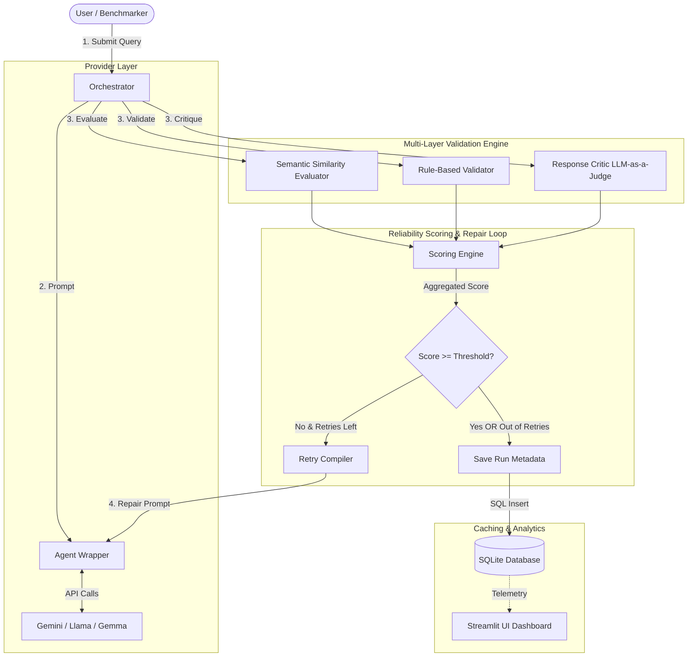
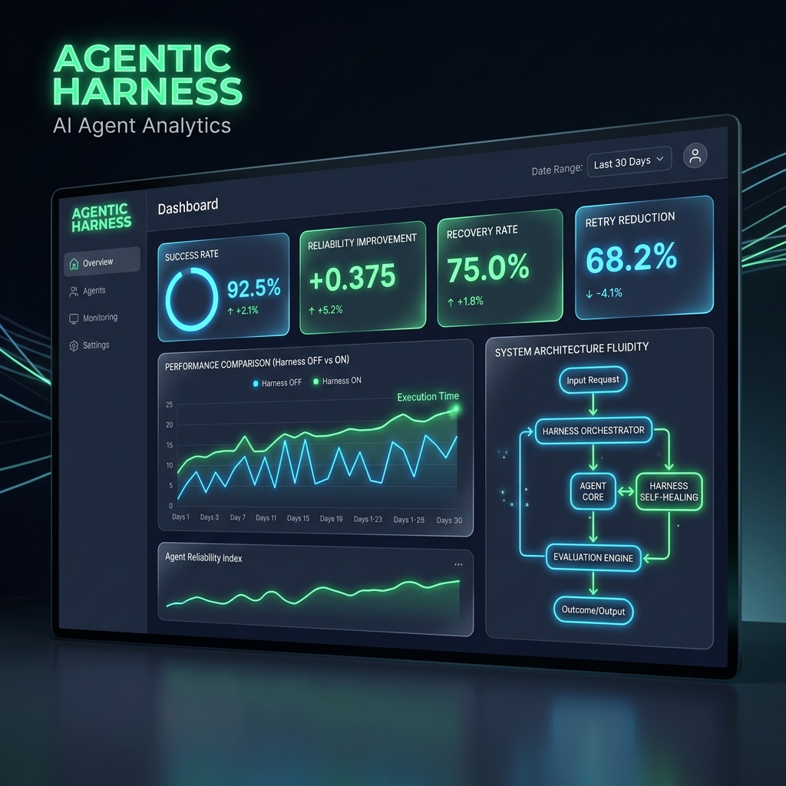
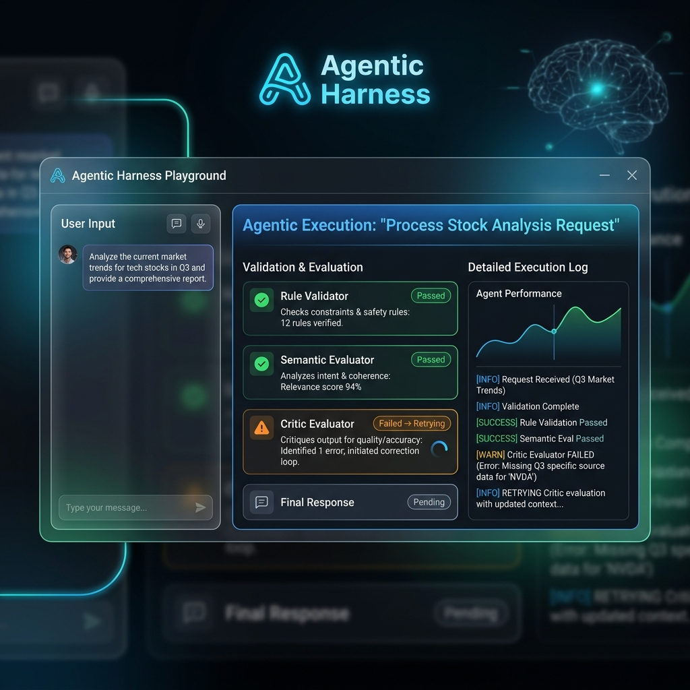
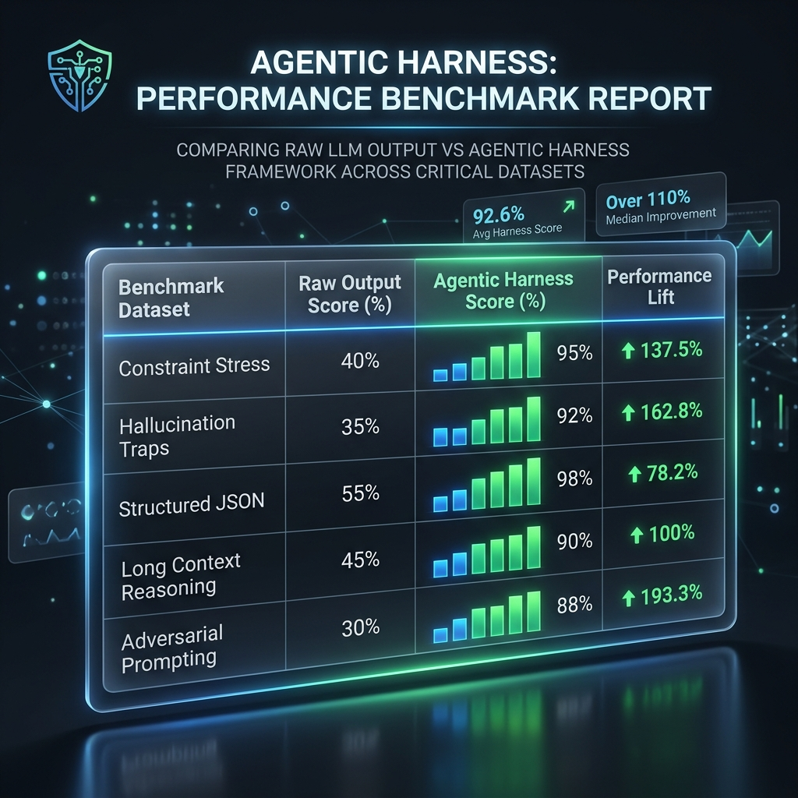

# Agentic Harness: Reliability & Self-Correction Framework

## Problem
Large Language Models (LLMs) are incredibly powerful, but in production, they:
- **Hallucinate** facts and logic
- **Ignore constraints** provided in the prompt
- **Produce invalid JSON** and structured data
- **Violate formatting requirements**
- **Lack transparency** in their decision-making process

## Solution
**Agentic Harness** is a reliability layer built on top of LLMs that transforms stochastic models into deterministic, highly reliable systems. It:
- **Validates outputs** against strict engineering rules
- **Evaluates quality** using semantic and LLM-as-a-judge approaches
- **Self-corrects failures** by compiling evaluation feedback into targeted retry prompts
- **Tracks reliability** through comprehensive scoring and analytics
- **Benchmarks performance** across standard and challenge datasets
- **Explains every decision** with transparent traces and rationale

---

## System Architecture



### Execution Flow
1. **Initiate**: User or benchmark script sends a query to the `Orchestrator`.
2. **First Attempt**: `Orchestrator` invokes the `Provider Layer` to get a raw response.
3. **Evaluate**: Output is parsed through task-specific evaluators (Semantic, Rules, or Critic).
4. **Aggregate**: Reliability weights are applied to output the `Overall Reliability Score`.
5. **Self-Correction Loop**: 
   - If the score is $\ge 0.80$, execution completes and passes.
   - If the score is $< 0.80$, the specific failure reasons are compiled into a repair prompt, sent back to the agent, and the flow iterates.
6. **Log & Cache**: The final state (including intermediate tries) is written to `harness_metrics.db` and cached to prevent redundant future API calls.

---

## Core Features

### 🛡️ Reliability & Self-Correction
- **Self-correction loops**: Automatically retry and fix failures before presenting results to the user.
- **Reliability scoring**: Composite quality index combining objective rules and subjective critic grades.
- **Retry compiler**: Formulates compiler-style corrective repair prompts.

### 🧠 Supported Models (Provider Layer)
Abstracted provider routing allows seamless switching and pacing for:
- **Gemini 2.5 Flash** & **Flash Lite**
- **Gemma 4 26B** & **31B**
- **Llama 3.1 8B Instant** (via Groq/OpenRouter)

### ✅ Validation
- **Character limits**: Strict boundary enforcement.
- **Keyword constraints**: Required and forbidden vocabulary checks.
- **Structured JSON validation**: Ensure schema adherence, type strictness, and parsability.

### ⚖️ Evaluation Layers
- **Semantic Evaluator**: Ground truth matching using dense embeddings (`all-MiniLM-L6-v2`) running locally on CPU.
- **Critic Evaluator**: LLM-as-a-judge for assessing context, unsupported claims, missing information, and logic.
- **Rule Validator**: Deterministic Python-based regex validator verifying formatting and syntax.

### 🔍 Explainability
- **Retry traces**: Transparent logging of every retry attempt and failure.
- **Critic rationale**: Detailed explanations of why an LLM judge assigned a specific score.
- **Deterministic Validation Report**: Clear breakdown of all rule-based checks.

### 📊 Benchmarking & Telemetry
- **Standard Benchmark Datasets**: 40 samples testing structured JSON, constraints, RAG, and extraction.
- **Challenge Datasets**: 14 stress tests containing deliberate failure cases, hallucination traps, and adversarial prompts.
- **SQLite Analytics**: Local storage persisting historical runs, calculating Success Rate, Reliability Improvement, Recovery Rate, and Retry Reduction natively for the dashboard.

### 💾 Smart Caching
- **Intervention-only cache**: SQLite repository indexing successful prompts to save API calls while preserving performance logic.

---

## Screenshots

### Dashboard


### Playground


### Benchmark Page


---

## Setup & Installation

### Local Setup
```bash
python -m venv venv
source venv/bin/activate
pip install -r requirements.txt
```

### Environment Setup
Create a `.env` file in the root directory and configure:
```text
GEMINI_API_KEY=your_actual_api_key_here
GROQ_API_KEY=your_groq_api_key_here
DEFAULT_MODEL=Llama 3.1 8B Instant
```

### Running & Verification

**Run Unit Tests**
```bash
pytest
```

**Launch Streamlit Dashboard & Playground**
```bash
streamlit run app/main.py
```

**Generate Portfolio Benchmarks**
*(Runs full Standard + Challenge datasets safely inside API limits)*
```bash
python scripts/generate_portfolio_benchmark.py
```

---
## Project Directory Structure

```text
agentic-harness/
├── app/                        # Streamlit UI Layer (Dashboard, Playground, Benchmarks)
├── data/                       # Benchmark & Challenge datasets
├── harness/                    # Core Framework Library
│   ├── agent/                  # LLM Provider Wrappers (Gemini, Groq, OpenRouter)
│   ├── evaluators/             # Semantic, Critic, and Rule Validators
│   ├── config.py               # Centralized configuration & thresholds
│   ├── database.py             # SQLite Telemetry implementation
│   ├── orchestrator.py         # Main execution & retry loop control
│   └── scoring.py              # Reliability math equations
├── reports/                    # Generated UI screenshots & exported data
├── scripts/                    # Automation & Benchmark Runners
└── tests/                      # Pytest verification suites
```