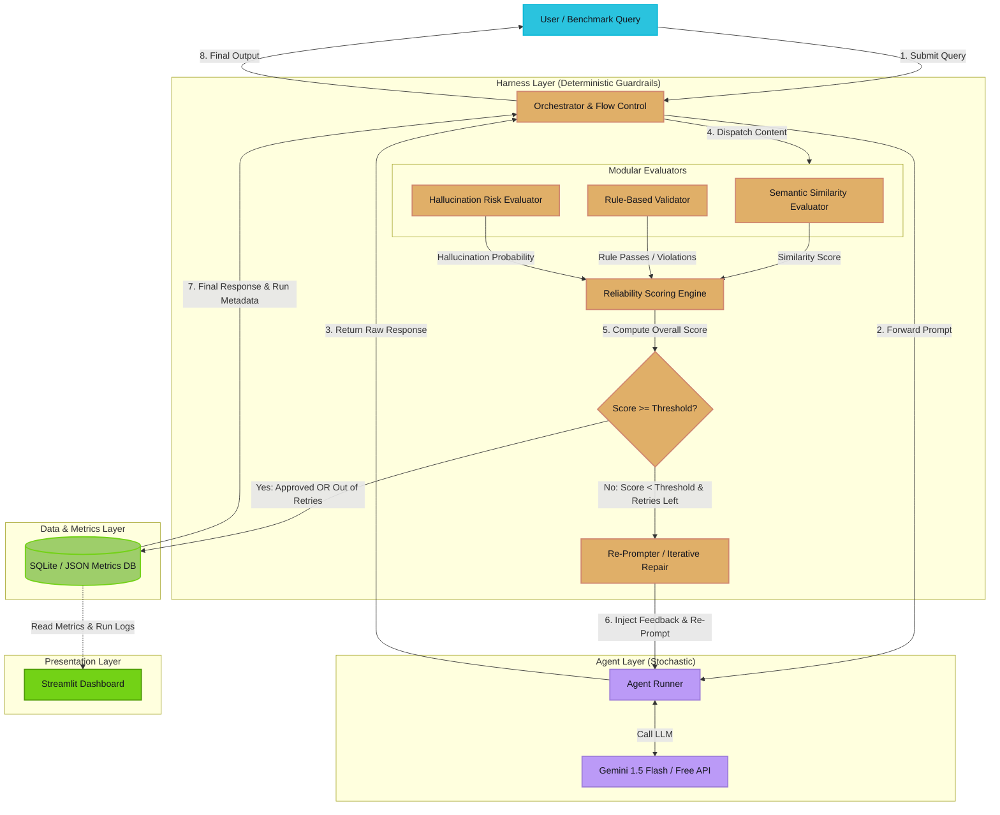
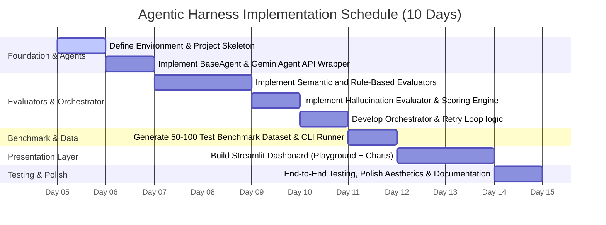

# Agentic Harness: Reliability, Evaluation & Monitoring Framework for AI Agents

This document defines the complete system architecture, component responsibilities, data flow, evaluation strategy, folder structure, and implementation roadmap for the **Agentic Harness** framework.

---

## 1. System Architecture

The core philosophy of **Agentic Harness** is to treat the LLM Agent as an untrusted, stochastic component and wrap it in a deterministic, rule-based, and semantic validation layer (the **Harness**). The harness monitors outputs, computes real-time reliability scores, and runs a self-correction retry loop before delivering the final response.

### Architectural Diagram



---

## 2. Folder Structure

To ensure maximum maintainability, modularity, and compliance with Python best practices, the codebase will follow this structured layout:

```text
agentic-harness/
│
├── README.md                           # Project introduction, setup guide, and demo instructions
├── requirements.txt                    # Project dependencies
├── .env.example                        # Example environment variables (API keys)
│
├── app/                                # Streamlit dashboard application
│   ├── main.py                         # Streamlit entry point (UI/UX layout)
│   ├── pages/                          # Streamlit sub-pages (e.g., benchmarking, run history)
│   │   ├── 1_📊_Live_Playground.py
│   │   └── 2_📈_Batch_Benchmark.py
│   └── components/                     # Reusable UI component modules
│       ├── metrics_cards.py
│       └── diff_viewer.py
│
├── harness/                            # Core Framework Logic
│   ├── __init__.py
│   ├── config.py                       # Configuration management (thresholds, API keys)
│   │
│   ├── agent/                          # Agent Interface
│   │   ├── __init__.py
│   │   ├── base_agent.py               # Abstract base agent class
│   │   └── gemini_agent.py             # Implementation using free Gemini API
│   │
│   ├── evaluators/                     # Evaluator modules
│   │   ├── __init__.py
│   │   ├── base_evaluator.py           # Abstract base evaluator class
│   │   ├── semantic.py                 # Semantic similarity evaluator
│   │   ├── rule_based.py               # Regex, structure, schema & negation checker
│   │   └── hallucination.py            # Self-Consistency & NLI-based evaluator
│   │
│   ├── orchestrator.py                 # Manages execution flow, evaluations, scoring, and retries
│   └── database.py                     # SQLite interface to store evaluation runs
│
├── data/                               # Benchmark Datasets
│   ├── benchmark_dataset.json          # Pre-defined test cases (50-100 samples)
│   └── reference_sources/              # Reference texts for RAG-style hallucination checks
│
├── tests/                              # Unit tests
│   ├── test_evaluators.py
│   └── test_orchestrator.py
│
└── scripts/                            # Helper CLI scripts
    └── run_benchmark.py                # Command-line benchmark runner
```

---

## 3. Component Responsibilities

| Module | Component | Responsibility | Technical Approach |
| :--- | :--- | :--- | :--- |
| **Agent** | `BaseAgent` | Interfaces standard API interactions so models can be swapped out transparently. | Abstract Base Class (ABC) in Python. |
| | `GeminiAgent` | Integrates Google's free-tier Gemini API for response generation. | `google-generativeai` package (Free tier). |
| **Evaluators** | `SemanticEvaluator` | Assesses semantic alignment of the response against target/reference outputs. | `sentence-transformers` (local `all-MiniLM-L6-v2`) for computing embedding cosine similarity. |
| | `RuleBasedValidator` | Performs deterministic checks on structural syntax and content rules. | Code-based logic checking for: empty output, JSON/XML parsing, blacklist words, code block validity, and contradiction keywords. |
| | `HallucinationEvaluator` | Measures the likelihood of fabricated facts or internal inconsistencies. | 1) **SelfcheckGPT / Self-Consistency**: Generates 3 answers at temperature > 0.0, evaluating semantic dispersion. 2) **NLI Context Alignment**: Local DeBERTa model checking if response entails or contradicts given source context. |
| **Orchestrator**| `Orchestrator` | Coordinates prompt feeding, running evaluators, computing the aggregated Reliability Score, managing the repair loop, and executing re-prompts. | Python logic handling loops, retries, history aggregation, and prompt repair construction. |
| | `Database` | Stores logs, inputs, outputs, scoring breakdowns, and retry histories for telemetry. | SQLite database with lightweight SQL queries/ORM. |
| **Dashboard** | `Streamlit App` | Renders a clean interface for recruiters/professors to experiment in a playground or run batch evaluation runs. | Streamlit + plotly/matplotlib for data visualizations, and `streamlit-diff-viewer` (or HTML diffs) for before/after comparison. |

---

## 4. Detailed Data Flow

### Step 1: Initialization & Query Dispatch
1. The user inputs a query or selects a test case from the benchmark dataset.
2. The query is submitted to the `Orchestrator` with two testing routes:
   - **Route A (Harness OFF)**: Raw agent execution with no intervention.
   - **Route B (Harness ON)**: Execution through the self-correcting Harness.

### Step 2: Agent Invocation
1. The `Orchestrator` formats the query and forwards it to the `Agent`.
2. The agent generates a candidate response using the designated model (Gemini 1.5 Flash).

### Step 3: Evaluation Suite Executions
Upon receiving the candidate response, the `Orchestrator` feeds it to the active evaluators:
1. **Semantic Evaluator**: Computes cosine similarity of response embeddings vs. ground-truth reference target ($S_{sem} \in [0, 1]$).
2. **Rule Evaluator**: Executes checks, producing a deduction score for formatting failures, length warnings, or JSON/code block parsing errors ($S_{rule} \in [0, 1]$).
3. **Hallucination Evaluator**: Checks consistency across multiple samples or entailment with reference documentation, producing a truthfulness probability ($S_{hal} \in [0, 1]$).

### Step 4: Scoring & Decision Making
1. The **Scoring Engine** computes the **Overall Reliability Score ($R$)** using a weighted average:
   $$R = w_{sem} \cdot S_{sem} + w_{rule} \cdot S_{rule} + w_{hal} \cdot S_{hal}$$
2. The orchestrator checks if $R \ge \text{Threshold}$ (e.g., $0.80$).
   - **If Yes (Pass)**: The orchestrator halts execution, records the metadata in the database, and returns the response.
   - **If No (Fail)**:
     - If `attempts < max_retries`, transition to **Step 5 (Retry/Re-prompt)**.
     - If `attempts == max_retries`, save response, mark as failed/degraded in the database, and return the final version.

### Step 5: Retry & Feedback Loop (Iterative Repair)
1. The orchestrator identifies which evaluators failed and why.
2. A **re-prompt feedback message** is constructed containing:
   - The original query.
   - The agent's previous response.
   - The specific failures (e.g., *"Rule check failed: The response must contain a valid JSON format. Your response was missing the closing brace."*).
3. The agent is re-prompted.
4. The system loops back to **Step 2** with `attempts = attempts + 1`.

---

## 5. Technology Stack Justification

| Technology | Role | Justification | Cost |
| :--- | :--- | :--- | :--- |
| **Python 3.10+** | Language | Industry-standard language for AI, data science, and LLM orchestration. | $0.00 (Open Source) |
| **Gemini 1.5 Flash (via SDK)** | LLM Agent | Offers a highly capable, fast, state-of-the-art model with a generous free API tier (15 RPM), preventing key leakage or credit card billing issues. | $0.00 (Free Tier) |
| **SentenceTransformers** | Embeddings | Runs completely locally on CPU; supports quick, resource-efficient cosine similarity checks for semantic scoring. | $0.00 (Open Source) |
| **transformers / ONNX Runtime** | NLI / Consistency | Local lightweight NLI classification model (e.g., `nli-deberta-v3-small`) to evaluate entailment between context and agent response. | $0.00 (Open Source) |
| **Streamlit** | Frontend / UI | Enables rapid building of interactive, sleek dashboard visualizations directly from Python. Fits the 10-day timeline perfectly. | $0.00 (Open Source) |
| **Plotly / Matplotlib** | Data Viz | Great interactive charting for rendering harness metrics, before-after accuracy stats, and response latency histograms. | $0.00 (Open Source) |
| **SQLite** | Database | Embeddable, file-based database. Zero configuration or cloud database costs required, while still providing robust SQL capabilities for telemetry. | $0.00 (Open Source) |

---

## 6. 10-Day Implementation Roadmap



### Day-by-Day Plan

#### Day 1: Project Setup & Agent Client
* Initialize repo structure (`app/`, `harness/`, `data/`).
* Configure local environment, `.env.example`, and verify dependencies.
* Build `BaseAgent` and implement `GeminiAgent` wrapper. Verify communication and error handling.

#### Day 2: Semantic & Rule-Based Evaluators
* Write `BaseEvaluator` abstract class.
* Implement `SemanticEvaluator` using `SentenceTransformers` (`all-MiniLM-L6-v2`) to compute semantic similarity against benchmark targets.
* Implement `RuleBasedValidator` focusing on regex parsing, JSON structure validation, and blacklisted word/empty response checks.

#### Day 3: Hallucination Evaluator & Scoring Engine
* Write `HallucinationEvaluator` leveraging:
  - SelfcheckGPT style self-consistency checking (3 samples at Temp > 0).
  - Lightweight local NLI classification model to measure entailment with ground-truth reference context.
* Design the weighted math engine in `ScoringEngine`.

#### Day 4: Orchestrator & Retry Mechanism
* Implement `Orchestrator` logic to bundle evaluation runs.
* Code the self-repair loop: constructing the feedback prompts containing specific error reports and executing the retry mechanism up to `max_retries`.
* Implement SQLite telemetry (`database.py`) to save logs, runs, latencies, and evaluations.

#### Day 5: Benchmark Dataset Creation
* Build the benchmark dataset (`data/benchmark_dataset.json`) consisting of 50-100 structured test queries covering multiple tasks (JSON extraction, factual retrieval, math/reasoning, formatting constraints).
* Write `scripts/run_benchmark.py` to run batches with Harness ON vs. Harness OFF and log comparative results into the database.

#### Day 6: Streamlit Playground Integration
* Create `app/main.py`.
* Implement the Live Playground page where users can input queries, toggle the Harness, view the live execution trace, observe scoring progress, and watch re-prompting happen in real-time.
* Add side-by-side agent output visual diffs (Before Harness vs. After Harness).

#### Day 7: Streamlit Batch Benchmarking & Charts
* Create the Batch Benchmark page in Streamlit.
* Add visual widgets to run the 50-100 sample benchmark suite directly from the UI.
* Render interactive dashboards: comparison metrics (average scores, success rate, hallucination rate, token usage, latency comparisons) when Harness is ON vs. OFF.

#### Day 8: UI Styling & Aesthetics Polish
* Enhance the UI styling (sleek dark mode theme, glassmorphism, responsive grids, custom metrics cards, and colored badge alerts).
* Ensure there are no raw code printouts or empty spaces. Use rich colors and professional typography.

#### Day 9: Testing, Optimization, & Verification
* Write unit tests in `tests/` to guarantee that individual evaluators behave predictably under failure conditions.
* Refactor scoring weight combinations to optimize accuracy while minimizing API calls.
* Add rate-limiting guards to respect Gemini's free tier quotas.

#### Day 10: Final Readme, Resume Optimization & Submission
* Complete `README.md` with:
  - Clean screenshot assets.
  - Setup steps, performance results (Harness ON: 95% success rate vs. Harness OFF: 60%).
  - Resume-oriented bullet points highlighting systems achievements (e.g., *“Built an AI Agent evaluation harness using Python, reducing structural errors by X% and hallucinations by Y% using local cross-encoder models and self-consistency heuristics”*).

---

## 7. Risks & Mitigation Strategies

| Risk | Impact | Likelihood | Mitigation Strategy |
| :--- | :--- | :--- | :--- |
| **API Rate Limits** (Gemini Free Tier) | High | Medium | 1. Implement client-side rate limit queues and exponential backoff. <br>2. Cache identical queries locally using a lightweight SQLite cache. <br>3. Allow benchmarking with simulated responses or cached datasets. |
| **Local Model Resource Constraints** | Medium | Low | Use highly optimized, tiny local models (e.g., `all-MiniLM-L6-v2` for embeddings and `nli-deberta-v3-small` for NLI). They require <1GB RAM and run on CPU within 100-300ms. |
| **Infinite Retry Loops** | High | Low | Enforce strict `max_retries` ceilings (default: 3) in the Orchestrator config, and log state metrics on why the model failed to correct. |
| **False Positives in Evaluations** | Medium | Medium | Expose threshold configurations as sliders in the Streamlit UI, allowing the user to tune sensitivities depending on the task. |

---

## 8. Future Extensions (For Resume Discussion)

During interviews with recruiters and engineers, discuss these design extensions to show architectural vision:
1. **Multi-Agent Harness**: Orchestrate hierarchical routing where specialized checking agents review generalist agents' work.
2. **Dynamic Harness Selection**: Automatically select which evaluators to run based on the detected intent of the user prompt (e.g., do not run Semantic Similarity on math/coding tasks, do not run strict Regex rules on creative writing).
3. **Memory-Aware Harnesses**: Enable evaluations to check for conversational drifts or factual consistency across multi-turn sessions.
4. **Adaptive Workflow Generation**: Generate customized validation rules dynamically based on prompt metadata.
