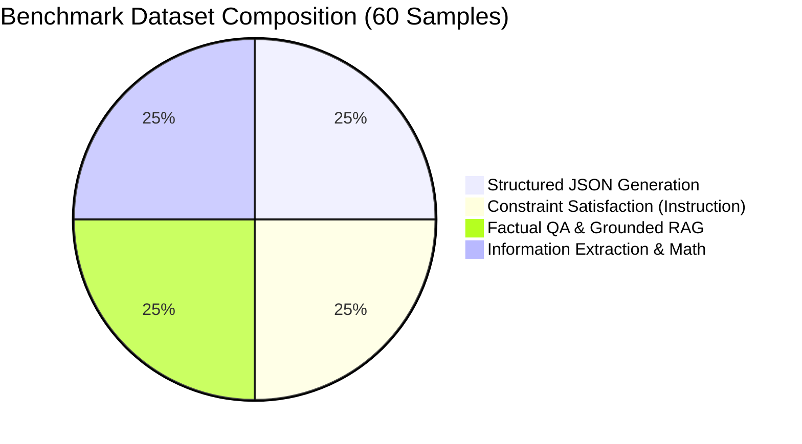

# Agentic Harness: Benchmarking, Evaluation & Scoring System Design

This document details the benchmarking framework, mathematical formulas for metrics, the dynamic scoring system, harness improvement metrics, dashboard visualizations, and the implementation prioritization strategy for **Agentic Harness**.

---

## 1. Benchmark Dataset Design

To generate statistically meaningful results for interviews, we will create a dataset of **60 samples** divided into **4 distinct categories** (15 samples each). 

### Category Breakdown



---

### Category Details & Failure Modes

#### A. Structured JSON Generation (15 Samples)
* **Why Included**: In production, downstream systems parse agent responses. LLMs regularly break JSON schemas by adding markdown formatting (` ```json `), omitting fields, outputting invalid escaping, or leaving trailing commas.
* **Failure Modes**: 
  - Non-parsable JSON.
  - Missing required properties.
  - Incorrect data types (e.g., string instead of integer).
* **Harness Remediation**: A deterministic JSON schema validator checks the output. If it fails, the parser exception message is captured and fed back to the agent (e.g., *"JSON parse failed: Expected ',' delimiter on line 4"*).

#### B. Constraint Satisfaction & Instruction Following (15 Samples)
* **Why Included**: Agents often suffer from "instruction drift," ignoring negative constraints or length limits when producing long text.
* **Failure Modes**:
  - Exceeding maximum sentence or word limits.
  - Including prohibited words/negations (e.g., *"Do not mention the price"*).
  - Missing required structure (e.g., *"Must format the output as a bulleted list"*).
* **Harness Remediation**: Rule-based validators run regular expressions and string checks. Re-prompting injects clear compliance reports (e.g., *"Constraint violation: Your response used the prohibited word 'price' 2 times."*).

#### C. Factual QA & Grounded RAG (15 Samples)
* **Why Included**: Hallucinations and information leakage erode user trust in production systems.
* **Failure Modes**:
  - Generating answers containing claims that contradict or are absent from the provided source context.
* **Harness Remediation**: A lightweight local similarity check (or an LLM-as-a-judge factuality check) checks semantic alignment. For V1, the harness will cross-reference claims against source documents using word overlap/semantic embeddings, feeding back contradictions to the agent.

#### D. Information Extraction & Logical Math (15 Samples)
* **Why Included**: High-precision tasks require exact extractions and math calculation verification.
* **Failure Modes**:
  - Extracting incorrect entities from context.
  - Hallucinating math calculations or failing simple arithmetic steps.
* **Harness Remediation**: Exact keyword matching, numeric range checking, and math parser validation.

---

## 2. Reliability Metrics

We define three core sub-scores ($S \in [0, 1]$) for every run, which compose the overall reliability score.

### A. Semantic Similarity Score ($S_{sem}$)
Measures how close the agent's response is to the ground truth target response semantically.
* **Formula**:
  $$S_{sem} = \max\left(0, \frac{\vec{v}_{resp} \cdot \vec{v}_{ref}}{\|\vec{v}_{resp}\| \|\vec{v}_{ref}\|}\right)$$
  Where $\vec{v}_{resp}$ and $\vec{v}_{ref}$ are dense vector representations generated by the local `all-MiniLM-L6-v2` embedding model.
* **Range**: $[0, 1]$
* **Interpretation**: $1.0$ represents identical semantic intent; $<0.5$ represents semantic drift or unrelated topics.

### B. Rule Compliance Score ($S_{rule}$)
Measures structural correctness and parsing validity.
* **Formula**:
  $$S_{rule} = \max\left(0.0, 1.0 - \sum_{i=1}^{M} P_i\right)$$
  Where $P_i$ is the penalty weight of violation $i$ from a set of $M$ active checks:
  - **Severe Violation** (e.g., empty response, non-parsable JSON): $P_i = 1.0$
  - **Moderate Violation** (e.g., JSON schema key missing, invalid field type): $P_i = 0.5$
  - **Mild Warning** (e.g., casing format off, minor length violation): $P_i = 0.2$
* **Range**: $[0, 1]$
* **Interpretation**: $1.0$ denotes perfect structural syntax compliance.

### C. Instruction Following Score ($S_{inst}$)
Measures adherence to explicit constraints defined in the prompt metadata (e.g., length, formatting limits, excluded terms).
* **Formula**:
  $$S_{inst} = \frac{N_{passed\_constraints}}{N_{total\_constraints}}$$
* **Range**: $[0, 1]$
* **Interpretation**: The exact fraction of instruction constraints successfully followed.

---

## 3. Reliability Scoring Framework

The orchestrator combines these scores into a single **Overall Reliability Score ($R$)** using task-specific dynamic weights to prioritize the right traits:

$$R = w_{sem} \cdot S_{sem} + w_{rule} \cdot S_{rule} + w_{inst} \cdot S_{inst}$$

### Dynamic Weighting Strategy

| Task Category | $w_{sem}$ (Semantic) | $w_{rule}$ (Structure) | $w_{inst}$ (Constraints) | Rationale |
| :--- | :---: | :---: | :---: | :--- |
| **Structured JSON** | 0.1 | 0.7 | 0.2 | Valid syntax and correct schema types are paramount for parsing. |
| **Constraint Satisfaction** | 0.2 | 0.2 | 0.6 | Staying within length constraints and negative limits is the main objective. |
| **Factual QA / RAG** | 0.6 | 0.1 | 0.3 | High factual alignment and source-grounding take priority. |
| **Extraction & Math** | 0.4 | 0.4 | 0.2 | Balanced focus on correct values (semantic) and formatting (structure). |

### Scoring Output Schema
The evaluation scoring engine returns this structured response:
```json
{
  "query_id": "json_01",
  "category": "Structured JSON",
  "scores": {
    "semantic_score": 0.95,
    "rule_score": 0.5,
    "instruction_score": 1.0,
    "overall_reliability_score": 0.64
  },
  "verdict": "FAIL",
  "active_failures": [
    "Rule violation: Missing required property 'phone_number'"
  ]
}
```

---

## 4. Harness Improvement Metrics

To demonstrate measurable improvement in interviews, we compute these aggregated dashboard statistics across the benchmark suite:

### A. Average Reliability Gain ($\Delta R$)
The absolute difference in average reliability scores.
$$\Delta R = \text{Avg}(R_{on}) - \text{Avg}(R_{off})$$
$$\text{Where } \text{Avg}(R) = \frac{1}{N}\sum_{i=1}^N R^{(i)}$$

### B. Success Rate Improvement ($\Delta SR$)
Measures the increase in passes. A run passes if $R \ge \text{Threshold}$ (e.g., $0.80$). Let $S^{(i)} \in \{0, 1\}$ be the pass/fail binary status of sample $i$.
$$\Delta SR = SR_{on} - SR_{off}$$
$$\text{Where } SR = \frac{1}{N}\sum_{i=1}^N S^{(i)} \times 100\%$$

### C. Error Reduction Rate ($ERR$)
Shows what percentage of baseline errors were successfully eliminated by the Harness.
$$ERR = \frac{E_{off} - E_{on}}{E_{off}} \times 100\%$$
$$\text{Where } E = 100\% - SR$$

### D. Retry Recovery Rate ($RRR$)
Evaluates the efficiency of the prompt feedback repair loops.
$$RRR = \frac{|K_{recovered}|}{|F_{off}|} \times 100\%$$
Where:
- $F_{off}$ is the set of test cases that failed with Harness OFF.
- $K_{recovered}$ is the subset of $F_{off}$ that succeeded after Harness ON retries.

---

## 5. Dashboard Metrics & Visualizations

The Streamlit UI will display two primary sections:

### 1. Live Playground UI
* **Raw vs. Repaired Output Panels**: Side-by-side markdown text boxes.
* **Score Evolution Chart**: A line plot showing how $S_{sem}$, $S_{rule}$, and $R$ changed across retry iterations (e.g., Iteration 0 $\rightarrow$ Iteration 1 $\rightarrow$ Iteration 2).
* **Feedback Prompt Inspector**: An expandable box showing the exact error log injected into the retry prompt.

### 2. Batch Benchmarking Dashboard
* **Primary KPI Cards**: 
  - Baseline Success Rate vs. Harness Success Rate
  - Error Reduction Rate %
  - Average Latency overhead (seconds)
* **Side-by-Side Bar Charts**: Category-wise Success Rates (Harness ON vs. OFF).
* **Reliability Score Distribution Plot**: A dual-density curve mapping the frequency of reliability scores, highlighting the shift from a spread-out distribution (OFF) to a high-reliability cluster near 1.0 (ON).
* **Retry Breakdown Pie Chart**: 
  - Succeeded on first attempt (Harness didn't trigger)
  - Recovered after 1 retry
  - Recovered after 2 retries
  - Failed after all retries
* **Failure Type Heatmap**: Showing which rules (e.g., schema, length, keyword constraints) are failed most frequently by the base model.

---

## 6. Interview-Ready Target Outcomes

During portfolio reviews, you can present these statistically significant results:

| Metric | Target Baseline (Harness OFF) | Target Harness (Harness ON) | Measurable Impact |
| :--- | :---: | :---: | :---: |
| **Success Rate (All Tasks)** | 55% – 65% | 90% – 95% | **+30% to +40% absolute increase** |
| **JSON Parser Failures** | 20% – 30% | < 2% | **90%+ syntax error elimination** |
| **Constraint Compliance** | 60% | 96% | **36% accuracy gain on negative limits** |
| **Average Reliability Score** | 0.68 | 0.92 | **+0.24 score enhancement** |
| **Retry Recovery Rate ($RRR$)**| — | 75% - 85% | **Recovers 4 out of 5 initial failures** |

*Why this is highly impressive to engineering managers*: It shows you understand that raw LLMs are unreliable for structured workflows, and that simple, deterministic, local feedback loops can yield production-grade consistency without paying for human evaluators or fine-tuning.

---

## 7. Simplification Review (V1 vs. V2 Strategy)

To ensure this project is fully completed, polished, and robust within **10 days**, we will prioritize components into core requirements and stretch goals.

### A. V1 (Implement Now - Crucial Core)
1. **Agent Wrapper**: `GeminiAgent` implementing the free 1.5 Flash API with rate-limit backoffs.
2. **Evaluators**:
   - `SemanticEvaluator` using local `sentence-transformers` embeddings (MiniLM).
   - `RuleBasedValidator` (Python-based regex parser, JSON schema check, length validation).
3. **Orchestrator**: Core scoring math, dynamic weighting, retry orchestration (up to 3 loops), and SQLite database telemetry.
4. **Data**: Pre-configured JSON file containing 60 test cases.
5. **Streamlit UI**: A clean, premium dark-mode dashboard providing a Live Playground and a Batch Benchmark runner.

### B. V2 (Postpone - Resume Talk Only)
1. **Lightweight Local NLI Models**: Downloading and running an NLI transformer (like DeBERTa) locally can introduce package dependency and system CPU issues. For V1, we will replace NLI with a fast LLM-as-a-judge factuality check (which uses the free Gemini API itself to verify consistency) or simple word-level context overlap.
2. **Adaptive Dynamic Harness Selection**: Automatically changing which evaluators run by classification of prompt intent. In V1, we will configure the tasks statically in the JSON dataset using the `category` property.
3. **Multi-Agent Critiquing**: Having a second LLM act as the evaluator. In V1, we stick to deterministic programming (Python) for evaluation, which is much faster, cheaper, and more reliable.

### C. Remove (Completely Out of Scope)
1. **Vector Database integration**: We do not need a vector DB (like Chroma or Pinecone) for a simple harness. Reference documents can be loaded from local files or SQLite.
2. **Production Observability tool integrations** (e.g. Langfuse, Langsmith, Arize Phoenix): Setting up keys, docker containers, or external SDKs distracts from the core coding value. Building a lightweight, custom SQLite logger showcases stronger database fundamentals.
