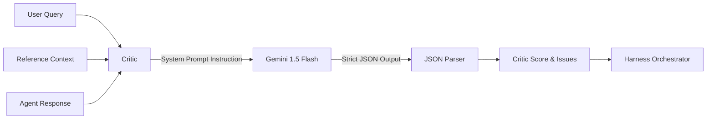
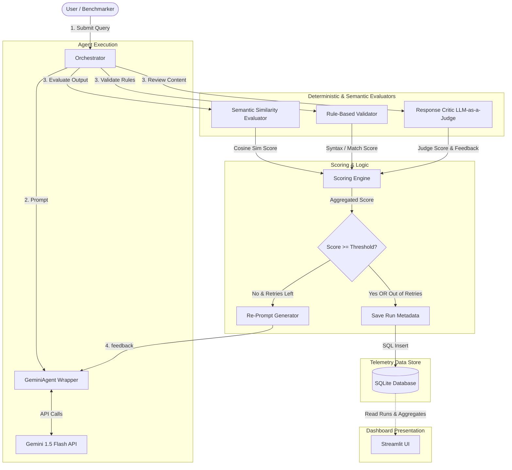

# Agentic Harness: Final V1 Design Specification

This document serves as the absolute source of truth and blueprint for the implementation of the **Agentic Harness** framework. It details the simplified system architecture, benchmark structure, evaluation metrics, scoring engine, storage design, dashboard layouts, folder hierarchy, and day-by-day implementation roadmap.

---

## PART 1 — ARCHITECTURE REVIEW

To maximize the probability of completing a high-quality portfolio-grade project within 7–10 days, we review the initial architecture and enforce strict scoping boundaries:

| Component / Module | Status | Rationale | Complexity Cost | Resume Value | Implementation Risk |
| :--- | :--- | :--- | :---: | :---: | :---: |
| **Agent Wrappers (`GeminiAgent`)** | **Keep Unchanged** | Interfacing the LLM is mandatory; Gemini 1.5 Flash API is free, fast, and easy to wrap. | Low | Medium | Low |
| **Semantic Similarity Evaluator** | **Keep Unchanged** | Sentence-transformers are lightweight (<120MB memory), run in milliseconds on CPU, and demonstrate local embedding expertise. | Low | High | Low |
| **Rule-Based Validator** | **Simplify** | Keep validator rules to regex, length, and schema validation. Avoid complex NLP parsing libraries (like NLTK or Spacy). | Low | Medium | Low |
| **Hallucination Evaluator** | **Simplify (Redesign)** | Replaced with a unified **Response Critic Module** (LLM-as-a-judge). Avoids downloading heavy local NLI DeBERTa models. | Low | High | Low |
| **SelfCheckGPT Multi-sampling** | **Remove** | Multi-sampling triples the API call count, risking Gemini rate-limits and high latency. | Low | Low | Medium (Rate limits) |
| **Vector Databases (Chroma/Pinecone)** | **Remove** | RAG reference contexts can be loaded directly from local JSON files or SQLite. No need for VDB overhead. | Medium | Low | Medium (Setup issues) |
| **Production Observability SDKs** | **Remove** | Telemetry and runs will be logged into a local lightweight database, showcasing custom DB engineering. | Medium | Low | Medium (Integration bugs) |
| **SQLite Telemetry Storage** | **Keep (Lightweight)**| SQLite is standard, built into Python, and allows simple SQL aggregates to drive Streamlit dashboards. | Low | High | Low |

---

## PART 2 — REQUIRED CHANGES

The following modules and dependencies are officially removed from the V1 scope:
1. **NLI/DeBERTa Transformers**: Removed to prevent local installation issues, massive CPU memory consumption, and dependency bloat.
2. **SelfCheckGPT Multi-sampling**: Removed to respect the Gemini API free tier limits (15 Requests Per Minute) and keep playground response latency under 3 seconds.
3. **Vector Databases**: Removed. Context retrieval is simplified to direct document/text mapping from local storage files.
4. **Third-party Observability SDKs (Langfuse/Arize/Phoenix)**: Removed. All metrics are logged locally using SQL.

---

## PART 3 — STORAGE DECISION

### Selected Approach: SQLite Database (`harness_metrics.db`)

We will use **SQLite** instead of flat JSON files. 

#### Justification for SQLite:
1. **Zero External Dependencies**: SQLite is built directly into the Python Standard Library (`sqlite3`). It requires no installation, configuration, or background servers.
2. **Efficient Streamlit Aggregations**: Streamlit dashboards require aggregate metrics (e.g., success rates, average reliability gains, recovery counts). Executing standard SQL queries (e.g., `SELECT avg(reliability_score), category FROM run_logs GROUP BY category, harness_enabled`) is far cleaner and faster than loading and traversing nested JSON structures in memory.
3. **Resume Impact**: Demonstrates data design literacy, schema normalization, and performance metrics logging—which are highly sought-after backend and systems engineering skills.

### Database Schema Design

We will implement two tables:

```sql
CREATE TABLE IF NOT EXISTS benchmark_runs (
    run_id TEXT PRIMARY KEY,
    timestamp DATETIME DEFAULT CURRENT_TIMESTAMP,
    harness_enabled INTEGER, -- 1 = ON, 0 = OFF
    avg_reliability REAL,
    success_rate REAL,
    total_samples INTEGER,
    total_retries INTEGER
);

CREATE TABLE IF NOT EXISTS run_logs (
    id INTEGER PRIMARY KEY AUTOINCREMENT,
    run_id TEXT,
    query_id TEXT,
    category TEXT,
    query_text TEXT,
    harness_enabled INTEGER,
    raw_response TEXT,
    final_response TEXT,
    semantic_score REAL,
    rule_score REAL,
    critic_score REAL,
    overall_reliability REAL,
    retry_count INTEGER,
    status TEXT, -- 'PASS' or 'FAIL'
    issues TEXT, -- JSON string list of failures
    FOREIGN KEY(run_id) REFERENCES benchmark_runs(run_id)
);
```

---

## PART 4 — RESPONSE CRITIC MODULE

The hallucination check is redesigned as an LLM-as-a-judge **Response Critic Module**. 

### Architecture & Integration



### Logic
The critic runs a single API call to Gemini 1.5 Flash. It is supplied with a system prompt that mandates checking the `Agent Response` against the `Reference Context` and `User Query` for:
1. **Unsupported claims**: Claims in the response not stated in the reference context.
2. **Missing information**: Missing key requirements specified in the user query.
3. **Factual consistency**: Internal contradictions within the response.
4. **Instruction violations**: Failing explicit directions.

### Output JSON Format
The critic is strictly instructed to return a JSON object structured as follows:
```json
{
  "score": 0.75,
  "issues": [
    "The response states the customer is premium, which is not supported by the context."
  ],
  "suggestions": [
    "Remove references to premium customer status."
  ]
}
```

### Integration into the Harness
* **If Critic Score < Threshold (e.g., 0.80)**: The orchestrator marks the evaluator as failed, adds the `issues` and `suggestions` to the feedback prompt, and triggers a retry.
* **If Critic Score >= Threshold**: The orchestrator records the score and marks it as a pass.

---

## PART 5 — JSON TASK EVALUATION REDESIGN

### Why Semantic Similarity is Inappropriate for JSON Evaluation
1. **Syntax Sensitivity**: A JSON string can be 99% semantically identical to target text, but if it lacks a closing brace `}`, it is completely invalid. Semantic models evaluate meaning, not syntax.
2. **Key-Value Binding**: Semantic models do not understand strict relational pairing. `{"user": "Alice", "admin": "Bob"}` and `{"user": "Bob", "admin": "Alice"}` share identical vocabulary and high semantic similarity, but represent opposite configurations.
3. **Type Strictness**: Semantics do not distinguish between `100` (integer) and `"100"` (string), which causes parsing failures in downstream systems.

### JSON Evaluator Logic
For Structured JSON tasks, we will bypass the `SemanticEvaluator` entirely and evaluate structural integrity:
1. **JSON Validity**: Runs `json.loads(response)`. Score = `1.0` if parsable, `0.0` if not.
2. **Schema Compliance**: Validates the keys and nested structures against the reference schema.
3. **Required Field Checks**: Confirms all mandatory keys are present.
4. **Data Type Validation**: Validates that values match defined types (e.g., list, int, bool).

**JSON Evaluation Score Formula**:
* If JSON parsing fails: $S_{rule} = 0.0$
* If JSON parsing succeeds: $S_{rule} = \max\left(0.0, 1.0 - 0.25 \times N_{errors}\right)$, where $N_{errors}$ is the number of schema violations (missing fields, wrong types).

---

## PART 6 — FINAL RELIABILITY FRAMEWORK

We define specific reliability formulas ($R$) per benchmark category, ensuring the metrics match the nature of the task:

### 1. Structured JSON Generation
* **Metrics Used**: `Rule Compliance Score` ($S_{rule}$) only. Semantic scoring is omitted.
* **Weights**: $w_{rule} = 1.0$
* **Equation**:
  $$R_{json} = S_{rule}$$

### 2. Constraint Satisfaction & Instruction Following
* **Metrics Used**: `Rule Compliance Score` ($S_{rule}$) (length, forbidden words) and `Response Critic Score` ($S_{critic}$) (instruction violations).
* **Weights**: $w_{rule} = 0.4$, $w_{critic} = 0.6$
* **Equation**:
  $$R_{const} = 0.4 \cdot S_{rule} + 0.6 \cdot S_{critic}$$

### 3. Factual QA & Grounded RAG
* **Metrics Used**: `Semantic Similarity Score` ($S_{sem}$) (matching reference answers) and `Response Critic Score` ($S_{critic}$) (factuality/hallucination checks).
* **Weights**: $w_{sem} = 0.4$, $w_{critic} = 0.6$
* **Equation**:
  $$R_{rag} = 0.4 \cdot S_{sem} + 0.6 \cdot S_{critic}$$

### 4. Information Extraction & Logical Math
* **Metrics Used**: `Semantic Similarity Score` ($S_{sem}$) (matching exact numerical/text values) and `Rule Compliance Score` ($S_{rule}$) (checking if numbers or strings match basic regex format).
* **Weights**: $w_{sem} = 0.5$, $w_{rule} = 0.5$
* **Equation**:
  $$R_{ext} = 0.5 \cdot S_{sem} + 0.5 \cdot S_{rule}$$

---

## PART 7 — DASHBOARD PRIORITIZATION

We will focus our Streamlit development strictly on the high-value features.

### Must Have (V1 - Core Implementation)
* **Harness ON/OFF Toggle**: Easily compare raw model output vs. harness-repaired output side-by-side.
* **Live Playground Trace**: An expander showing the step-by-step scoring metrics, failure reasons, and re-prompt logs.
* **Metrics KPI Cards**:
  - Success Rate (ON vs OFF)
  - Avg Reliability (ON vs OFF)
  - Error Reduction Rate %
  - Average Latency overhead (seconds)
* **Before vs. After Comparison**: Clear side-by-side text inputs.
* **Batch Benchmark Runner**: Visual button to run the 60-sample suite and update the SQLite database.

### Nice To Have (If Time Permits)
* **Category Performance Chart**: A simple side-by-side bar chart showing ON vs OFF success rates per task category.
* **Retry Recovery Stacked Bar**: Distribution of test cases succeeding on try 1, try 2, try 3, or failing entirely.

### Future (Postponed to V2 / Excluded)
* **Error Heatmaps**: Advanced visualization of multi-agent failures.
* **Real-time token pricing/monitoring**: Tracking API spending.

---

## PART 8 — FINAL FOLDER STRUCTURE

Only the directories and modules below will be implemented:

```text
agentic-harness/
│
├── requirements.txt            # Package dependencies (streamlit, sentence-transformers, google-generativeai, plotly)
├── .env.example                # Example environment file
├── README.md                   # Project Setup and Run Instructions
│
├── app/                        # Streamlit UI Layer
│   ├── main.py                 # Sidebar navigation & home dashboard
│   └── pages/                  # Subpages
│       ├── 1_🎮_Playground.py   # Interactive single query tester
│       └── 2_📊_Benchmark.py   # Run and view batch measurements
│
├── harness/                    # Core Framework
│   ├── __init__.py
│   ├── config.py               # Weights, thresholds, and keys
│   ├── database.py             # SQLite interface for runs and run_logs
│   ├── orchestrator.py         # Primary evaluation & retry loop control
│   │
│   ├── agent/                  # Agent Wrappers
│   │   ├── __init__.py
│   │   ├── base_agent.py       # Abstract Base Agent
│   │   └── gemini_agent.py     # Gemini SDK client
│   │
│   └── evaluators/             # Evaluator Modules
│       ├── __init__.py
│       ├── base_evaluator.py   # Abstract Base Evaluator
│       ├── semantic.py         # SentenceTransformers cosine similarity
│       ├── rule_based.py       # JSON syntax check, regex & length limits
│       └── critic.py           # LLM-as-a-judge factuality & constraint check
│
└── data/                       # Benchmark data
    └── benchmark_dataset.json  # 60 test cases with categories, inputs, and references
```

---

## PART 9 — FINAL IMPLEMENTATION ROADMAP

```text
Day 1: Setup, SQLite Schema & Agent Wrapper
  - Create directory skeleton and requirements.txt.
  - Write harness/database.py (run logs, schema creation).
  - Implement harness/agent/base_agent.py and gemini_agent.py. Confirm Gemini API connectivity.

Day 2: Evaluator Modules
  - Write harness/evaluators/base_evaluator.py.
  - Implement semantic.py using local SentenceTransformers ('all-MiniLM-L6-v2').
  - Implement rule_based.py (JSON schema check, length validation, regex limits).

Day 3: Critic Module & Scoring Engine
  - Implement critic.py containing LLM-as-a-judge evaluation prompts.
  - Program the reliability weights framework within harness/orchestrator.py.

Day 4: Orchestrator & Repair Logic
  - Implement the main evaluation loop in orchestrator.py.
  - Code the re-prompters to read critic/rule suggestions, inject them into the query prompt, and iterate.
  - Save run outcomes to the SQLite database.

Day 5: Benchmark Dataset Generation
  - Create data/benchmark_dataset.json containing exactly 60 test queries (15 per category).
  - Include ground truth schemas and contexts.
  - Write a console script scripts/run_benchmark.py to test database operations.

Day 6: Streamlit Playground Integration
  - Write app/main.py.
  - Develop app/pages/1_🎮_Playground.py.
  - Allow manual testing: show Raw Agent Output, evaluation logs, re-prompting feedback, and final outputs.

Day 7: Streamlit Batch Benchmarking & Charts
  - Develop app/pages/2_📊_Benchmark.py.
  - Add button to trigger batch benchmarking on the 60 samples.
  - Render KPIs (Success Rates, Avg Reliability, Recovery Rate, Latency Overhead).
  - Draw category success comparison bars using Plotly.

Day 8: Styling & Aesthetic Polish
  - Apply custom Streamlit dark theme.
  - Improve readability using customized metric cards, clean expandable trace windows, and markdown tables.

Day 9: Robustness Testing & Code Cleanup
  - Test edge cases (Gemini rate-limits, completely empty agent outputs, invalid JSON inputs).
  - Refactor configuration parameters (thresholds, weights) into harness/config.py.

Day 10: README Documentation & Portfolio Preparation
  - Complete README.md. Write clear installation instructions.
  - Detail resume bullet points focusing on quantitative metrics (e.g., "Achieved a 93% schema-compliance rate on structured outputs compared to a 60% baseline...").
```

---

## PART 10 — FINAL PROJECT DEFINITION

### 1. Final Architecture Diagram



### 2. Final Data Flow
1. **Initiate**: The runner sends a query to the `Orchestrator`.
2. **First Attempt**: `Orchestrator` invokes `GeminiAgent` to get a raw response.
3. **Evaluate**: `Orchestrator` runs task-specific evaluators (Semantic, Rules, or Critic).
4. **Aggregate**: The weights are applied to output the `Overall Reliability Score`.
5. **Decide**: 
   - If the score is $\ge 0.80$, loop ends.
   - If the score is $< 0.80$ and attempts $< 3$, the failed validator's specific feedback is compiled into a re-prompt, sent to `GeminiAgent`, and the flow restarts at step 3.
6. **Log**: The final state (including intermediate tries) is written to `harness_metrics.db`.

### 3. Final Tech Stack
* **Language**: Python 3.10+
* **LLM**: Gemini 1.5 Flash (via free API key)
* **Embeddings**: `sentence-transformers` (`all-MiniLM-L6-v2` - 120MB, CPU local execution)
* **Database**: `sqlite3` (built-in)
* **Frontend**: Streamlit + Plotly

### 4. Final Benchmark Design
* **Dataset Size**: 60 samples.
* **Categories**:
  1. *Structured JSON*: Schema constraint evaluation (JSON Validity, Data Types, Keys).
  2. *Constraint Satisfaction*: Adherence to negative limits (length, forbidden tokens).
  3. *Factual QA / Grounded RAG*: Text grounding evaluation (claims match context).
  4. *Extraction / Math*: Strict text retrieval and logic (regex matching, math verification).

### 5. Final Deliverables
1. **Harness Package**: Codebase implementing `orchestrator`, `evaluators`, and `agent` clients.
2. **Streamlit UI**: User playground + benchmark comparison dashboard.
3. **Database**: Pre-configured SQLite schema + historical benchmark records.
4. **Dataset**: `benchmark_dataset.json` containing 60 evaluation samples.
5. **Resume Bullets**: Written statements detailing quantitative reliability achievements.
