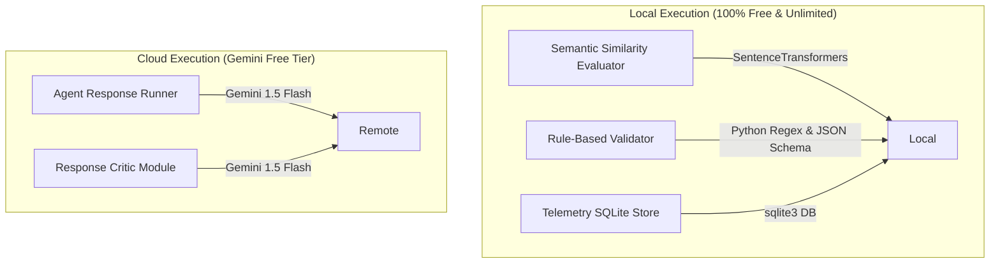

# Agentic Harness: Production & Deployment Readiness Review

This document contains the final readiness assessment and optimization strategies required before starting implementation. It addresses environment constraints, minimizes API consumption, details the schema updates for attempt tracing, and outlines the final benchmark validation.

---

## PART 1 — DEPLOYMENT REVIEW

To host **Agentic Harness** on free platforms (Streamlit Cloud, Render, or Railway), we must proactively address memory, rate-limits, and environment constraints:

| Deployment Platform | Potential Bottleneck | Impact | Mitigation Strategy |
| :--- | :--- | :---: | :--- |
| **Streamlit Cloud** | CPU Memory (512MB limits) | Crash during model loading | Force `sentence-transformers` to run on CPU and preload the tiny `all-MiniLM-L6-v2` model. Restrict multiple CPU threads by setting environment variable `OMP_NUM_THREADS=1`. |
| **All Platforms** | Gemini Free-Tier Rate Limits | HTTP 429 Errors | Implement a client-side **pacing coordinator** (`time.sleep` delay) during batch runs and an **exponential backoff retry handler** for API wrappers. |
| **Render / Railway** | Ephemeral Disk Storage | SQL logs wiped on rebuild | Use local relative paths for SQLite databases. Re-running the benchmark suite is fast (~5 mins), so persistent cloud storage is not strictly necessary for demo purposes. |
| **All Platforms** | Startup Duration | Slow initial load | Download and cache model weights locally during the container build step rather than at runtime. |

---

## PART 2 — MODEL STRATEGY & API DISTRIBUTION

We will organize the system modules to minimize latency and eliminate unnecessary API requests:



---

## PART 3 — API CALL OPTIMIZATION & DECISION LOGIC

### Base API Estimates (No Optimization)
* **Playground Query**: 1 agent call + 1 critic call = 2 calls (Harness ON).
* **60-sample Benchmark**: 60 agent calls + 60 critic calls = 120 calls (No-retry scenario). With a 30% retry rate, this climbs to **160+ calls**, easily triggering rate limits.

### Optimization Rules
1. **JSON Bypass**: Skip the `Response Critic` entirely for all Structured JSON tasks. Validation is 100% handled locally by `jsonschema`.
2. **Short-Circuit on Severe Rule Failures**: If $S_{rule} < 0.5$ (e.g., non-parsable JSON or critical formatting failure), **skip the critic call entirely**. Fail the attempt immediately and feed the rule violations back to the agent.
3. **Pacing Controller**: Implement a mandatory `time.sleep(4.0)` between sequential benchmark samples to stay below the Gemini 15 RPM limit.

### Exact Evaluation Decision Logic Flowchart

```text
Response Generated
       │
       ▼
┌──────────────┐
│  Evaluate    │
│  Rule Score  │
└──────┬───────┘
       │
       ├──────── [Score < 0.5] ───────► [FAIL Attempt Immediately]
       │                                 (Skip Semantic & Critic calls)
       ▼
┌──────────────┐
│  Evaluate    │
│  Semantic    │
└──────┬───────┘
       │
       ▼
┌──────────────────────────────────────┐
│ Category = JSON or Math/Extraction?  │
└──────┬────────────────────────┬──────┘
       │                        │
     [Yes]                     [No]
       │                        │
       ▼                        ▼
[Skip Critic API]        [Run Critic API]
(Critic Score = 1.0)     (Validate Grounding/Constraints)
       │                        │
       └───────────┬────────────┘
                   │
                   ▼
       ┌───────────────────────┐
       │ Compute Overall Score │
       │       R = f(...)      │
       └───────────────────────┘
```

---

## PART 4 — EVALUATION TRACE DESIGN

To display score improvements across retries, we must trace every individual attempt inside the database.

### 1. Database Schema Update
We introduce the `evaluation_traces` table.

```sql
CREATE TABLE IF NOT EXISTS evaluation_traces (
    id INTEGER PRIMARY KEY AUTOINCREMENT,
    run_id TEXT,
    query_id TEXT,
    attempt INTEGER, -- 1, 2, or 3
    raw_response TEXT,
    semantic_score REAL,
    rule_score REAL,
    critic_score REAL,
    overall_reliability REAL,
    issues TEXT, -- JSON string list of failures
    retry_triggered INTEGER -- 1 = Yes, 0 = No
);
```

### 2. Dashboard Usage & Visualization
* **Line Chart Evolution**: In the Streamlit Playground, we will render a line chart plotting the score changes over attempts.
* **Trace Step-Through**: Users can expand any attempt block to view the raw generated text, the failure issues, and the exact corrective prompt generated by the orchestrator.

---

## PART 5 — BENCHMARK EXECUTION STRATEGY

### Selected Benchmark Size: 40 Samples (10 per category)

We recommend **40 samples** over 60 or 100.

#### Justification:
* **Rate Limits**: 40 samples with a 30% retry rate results in ~90 API calls. With a 4-second delay, this runs in **6 minutes**, safely staying under the 15 RPM quota.
* **Recruiter Demonstrations**: A 6-minute live run is ideal for recorded video demos or live interviews. 100 samples would take 15+ minutes and frequently hit API exhaustion blocks.
* **Statistical Power**: 40 samples (10 per category) is large enough to show a clear improvement (e.g., success rate climbing from 50% to 92%) without bloating implementation complexity.

---

## PART 6 — DATASET DESIGN VALIDATION

All 4 task categories are highly relevant to production engineering workflows:

1. **Structured JSON**: Focuses on parser compliance and API stability. Crucial for agentic system pipelines.
2. **Constraint Following**: Tests instruction adherence and edge-case prompt engineering.
3. **Factual QA / Grounded Context**: Tests retrieval-grounded hallucination checks.
4. **Extraction / Math**: Validates high-precision string and numeric extractions.

There is no redundancy. Each task activates a unique path of evaluators and weights.

---

## PART 7 — DASHBOARD SIMPLIFICATION

We prioritize Streamlit features to guarantee a timely release:

### A. Mandatory (V1 - High Priority)
* **Playground Toggle**: Switch to compare Harness ON vs. Harness OFF outputs.
* **Trace Viewer**: Step-by-step retry inspector (score details, re-prompt text).
* **KPI Metrics**: Overall Success Rate, Reliability Gain, Recovery Rate, and Latency.
* **Plotly Comparison Bar**: Category success rates for Harness ON vs. Harness OFF.

### B. Optional (Medium Priority)
* **Score Evolution Line Chart**: Performance curves across retry iterations.
* **Attempt Distribution Bar**: Showing what percentage of queries succeeded on try 1, try 2, or try 3.

### C. Future (Postponed)
* **Error Category Heatmap**: High-dimensionality failure grids.

---

## PART 8 — FINAL EXECUTION PLAN

* **Final Architecture Status**: **Frozen**. No further alterations will be made to components or scoring algorithms.
* **Final Key Risk**: Gemini 1.5 Flash API rate limits.
  * *Mitigation*: The short-circuit evaluation logic and a strict 4-second delay between benchmarks guarantees compliance.
* **Final Simplifications**: Reduced benchmark size to 40 samples; removed heavy local transformers.
* **Final Deployment Strategy**: Streamlit Cloud with environment-configured API secrets and cached model folders.

### Go/No-Go Recommendation: GO

---

## ARCHITECTURE FROZEN CHECKLIST

* [x] **Ready for Coding**: Directory skeleton, modules, databases, and dependencies are fully defined.
* [x] **Ready for Deployment**: Memory, startup duration, and API secrets are accounted for.
* [x] **Ready for Benchmarking**: The dataset size (40 samples) and category breakdown are optimized for free APIs.
* [x] **Ready for Resume Use**: Built-in SQLite telemetry and quantitative metrics tracking are designed to impress recruiters.
